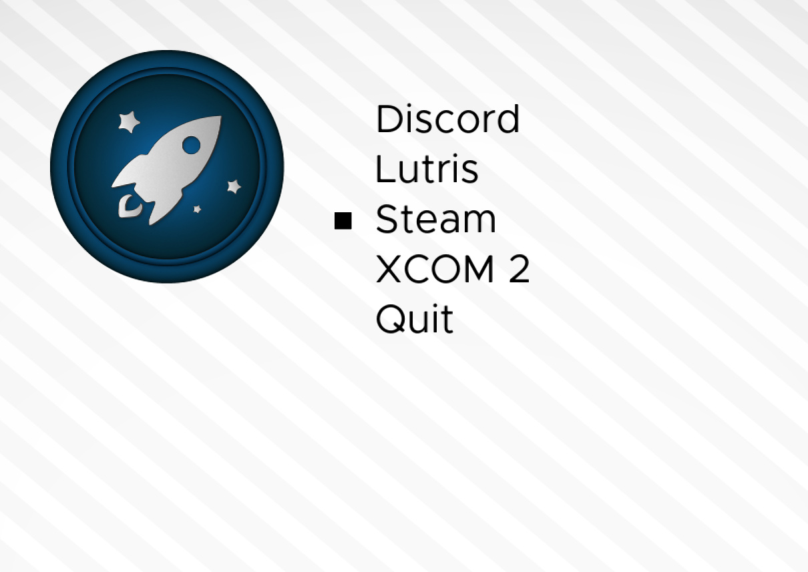

# Launcher

Launch games and applications through [RetroArch](http://libretro.com) + [ChaiLove](https://github.com/libretro/libretro-chailove).



## Installation

ChaiLove Launcher can be run through [RetroArch](https://retroarch.com/) and [ChaiLove](https://github.com/libretro/libretro-chailove)...

1. Install [RetroArch](https://retroarch.com)

2. Install [ChaiLove](https://github.com/libretro/libretro-chailove)

3. Download the [ChaiLove Launcher](http://github.com/RobLoach/ChaiLove-Launcher)
	```
	git clone https://github.com/RobLoach/ChaiLove-Launcher.git
	```

4. Edit [menu.json](menu.json) with the games you would like to have in the menu.

5. Launch ChaiLove-Launcher's `main.chai` through RetroArch:
	```
	retroarch -L chailove_libretro.so ChaiLove-Launcher/main.chai
	```

## Attribution

- [Rob Loach](https://robloach.net)
- [Bossa-Nova](https://opengameart.org/content/bossa-nova) by [Joth](https://opengameart.org/users/joth)
- [Mac Apps Icon Set](https://www.deviantart.com/rud3boy/art/Mac-Apps-Icon-Set-354798037) by [Rud3Boy](http://rud3boy.deviantart.com)
- [Metropolis Font](https://fontlibrary.org/en/font/metropolis)
